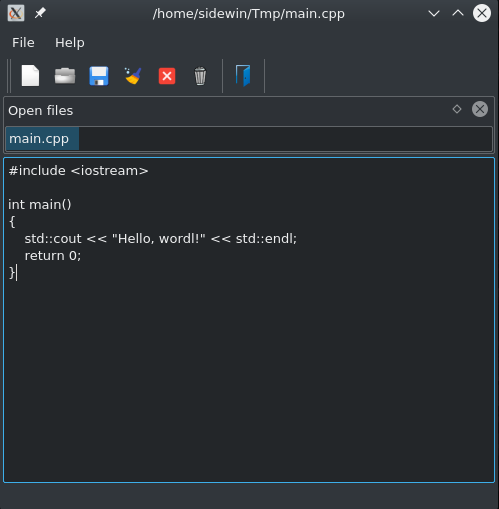

# Sidewinder File Editor (SFe)

Hi everyone!

This is simple program type of "proof of concept".
I create this program to learn more about C++ and QT library.


*** BUILD INSTRUCTION ***

*This project require: Qt library, qmake and make tool.*

*This program has been tested on Manjaro and Debian Linux.*


1. Prepare source:
  ```bash
  $ git clone https://github.com/Sidewinder22/SideFileEditor.git
  $ cd SideFileEditor
  ```

2. Build the source:

  Remember to use qmake for QT5!
  ```bash
  $ mkdir build && cd build
  $ qmake ..         // qmake-qt5
  $ make
  ```

3. Run project:
  ```bash
  $ ./SideFileEditor
  ```


