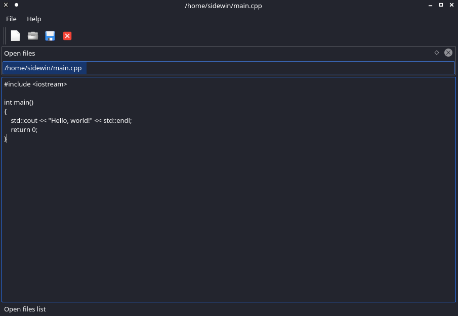

# Sidewinder File Editor (SFe)

Hi everyone!

This is a simple program type of "proof of concept".  
I create this project to learn more about C++ (14/17/20) and QT5 library.

*This project require: Qt library, qmake and make tools.*

## Build instruction

### Build

To build source use script:

    ./build.sh

Or build it manually:

    mkdir build && cd build
    qmake ..
    make -j $(nproc)

### Run

To run project:

    cd build
    ./SFe

